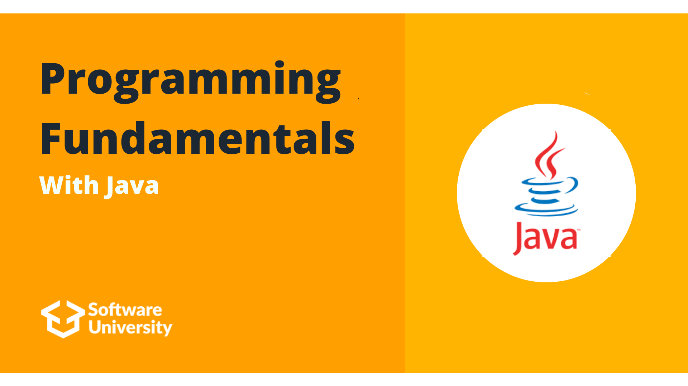

# Softuni Programming Fundamentals With Java

## Intro

## Course topics
### Basic Syntax, Conditional Statements and Loops
- [Lab](https://github.com/DenisBuserski/Softuni_Programming_Fundamentals_Java/tree/main/Basic_Syntax_Conditional_Statements_And_Loops_Lab)
- Exercise
- More Exercise
### Data Types and Variables
- Lab
- Exercise
- More Exercise
### Arrays
- Lab
- Exercise
- More Exercise
### Methods
- Lab
- Exercise
- More Exercise
### Lists
- Lab
- Exercise
- More Exercise
### Objects and Classes
- Lab
- Exercise
- More Exercise
### Associative Arrays
- Lab
- Exercise
- More Exercise
### Text Processing
- Lab
- Exercise
- More Exercise
### Regular Expressions
- Lab
- Exercise
- More Exercise

## Exams

## Certificates
